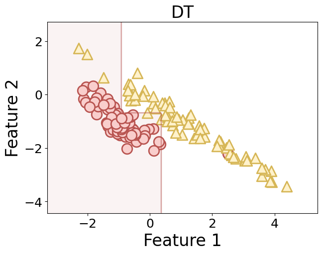
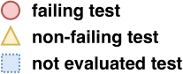

# About

This repository holds the implementation and evaluation results of the NSGA-II-SVM approach presented in the paper with the title submitted at DeepTest@ICSE24: "Guiding the Search Towards Failure-Inducing Test Inputs Using Support Vector Machines".

## Algorithm

The reflection study has been conducted with the support of the open-source and modular testing framework [OpenSBT](https://git.fortiss.org/opensbt/opensbt-core). The implementation is provided [here](algorithm/kernel_svm.py). The algorithm integrated into OpenSBT can be found [here](application/opensbt-svm.zip).

## Results Combined

The *Hypervolume/General Distance/Spread* analysis results after 10 runs are available here: 

The detailed *Hypervolume* analysis results are available here: [HV](/results/hv/)

The *Spread* analysis results are available here: [Spread](/results/sp/) 

The *General Distance* analysis results are available here: [GD](/results/gd/) 
The estimated Pareto front is available here: [PF](/results/estimated_pf.csv)

The results related to the number of distinct critical testcases are available here: [Distinct Failures](/results/n_crit/) 

The corresponding statistical analysis results for the metric `METRICNAME` can be found in the file `METRICNAME_significance.csv` in the corresponding metric folder.

Note, that in the graphs more evaluations are visible done by NSGA-II-DT then used for the comparison (1000), as the execution time of NSGA-II-DT is not controllable because of the flexible population size.

## Results Ratio Sampling

Below are provided results which show the ratio of critical test cases from all sampled tests in an SVM region over time (9 SVM generations per run) for all runs and on average. This metric should assess the guidance of the SVM Model with increasing number of SVM iterations. 

The detailed results are provided here: [Results ratio](results/ratio/svm_ratio.txt)

## Additional Material
### Motivation

    

        
        
    

     <figcaption>
     Illustration of difference between boundary identification by a Decision Tree and Support Vector Machine for data from two classes(circle/triangle positive/negative data).
     </figcaption>

### Approach Overview

    

        
        
        
        
        
    

   

    <figcaption>
     Overview of the main steps of NSGA-II-SVM. 1. Figure: Genetic search using NSGA-II. 2. Figure: Learned SVM-model for failing region prediction and sampling inside region. 3. Figure: Genetic search with NSGA-II in subsequent iteration using evaluated samples and best solutions found. 4. Figure: Refined SVM-model learning. Arrows indicate genetic operations.
     </figcaption>

